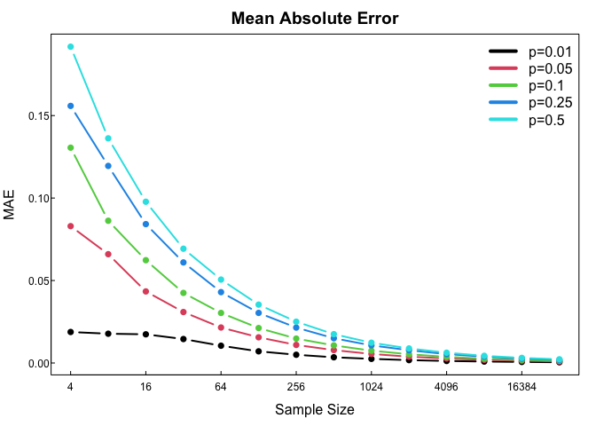
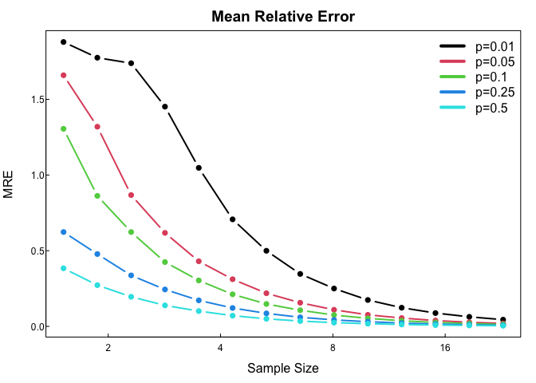

02-monte-carlo-error
================
Wenqi Lyu
9/7/2020

# Plot

``` r
#Plot function
plotstyle <- function(data = NULL, style = NULL,...){
  pstl <- deparse(substitute(style))
  
  if(pstl == "NULL"){
    par(
      mar=c(1,1,.1,.1)*2,
      mgp=c(1,0,0),
      tcl=.2,
      cex.axis=.75,
      col.axis="black",
      pch=16
    )
  }else if(pstl == "tight"){
    par(
      mar=c(1,1,.01,.01)*2,
      mgp=c(1,0,0),
      tcl=.2,
      cex.axis=.75,
      col.axis="black"
    )
  }else if(pstl == "upright"){
    par(
      mar=c(1.1,1.1,.1,.1)*2,
      mgp=c(1.1,0.1,0),
      tcl=.2,
      cex.axis=.75,
      col.axis="black",
      pch = 16,
      las = 1
    )
  }
  par(...)
  invisible(data)
}

plot_setup <- function(d, f, xlim = NULL, ylim = NULL, log = "", asp = NA, xaxs = "r", yaxs = "r", ...){
  #browser()
  if(is.null(f)){
    v <- 1:4; dim(v) <- c(2,2)
  }else{
    v <- model.frame(f, data = d) %>% apply(2, range)  
  }
  
  if(is.null(xlim)) xlim <- v[,2]
  if(is.null(ylim)) ylim <- v[,1]
  plot.new()
  par(...)
  plot.window(xlim = xlim, ylim = ylim, log = log, asp = asp, xaxs = xaxs, yaxs = yaxs)
  d
}

lwith <- function(l, ...) lapply(l, function(x, ...){with(x, ...)}, ... )
`%|%` <- function(a,b) paste0(a,b)
```

``` r
library("magrittr")
library("dplyr")
library("showtext")
library("sysfonts")
library("showtextdb")
library("tidyr")
```

``` r
# Parameters 
#   Sample size = 2^(2:15)
#   Underlying true probability = c(0.01,0.05,0.10, 0.25, 0.50)
#   Parameters a list
parameters <- list(R = 5000, ss = 4, p = .1)
# Process
#   Generationg biomial RV of a specific sample size and specific probability
create_data_estimate_p <- function(parameters){
  parameters$p_hat <- rbinom(parameters$R, parameters$ss,  parameters$p)/parameters$ss
  parameters
}

absolute_error <- function(parameters){
  abs(parameters$p_hat - parameters$p)
}

relative_error <- function(parameters){
  abs(parameters$p_hat - parameters$p)/parameters$p
}

create_data_estimate_p <- function(parameters){
  parameters$p_hat <- rbinom(parameters$R, parameters$ss,  parameters$p)/parameters$ss
  parameters
}

# Property
#    Absolute error |p̂−p|
#    Relative error |p̂−p|/p.
# Repeat
#    Distribution
one_p_n <- function(parameters){
 ae <- parameters %>% create_data_estimate_p %>% absolute_error
 re <- ae/parameters$p
 mae <- mean(ae)
 mre <- mean(re) 
 c(mae,mre)
}
simulation_settings <- expand.grid(
  R = 5000
, p = c(0.01, 0.05, 0.1, 0.25, 0.5)
, ss = 2^(2:15)
, mae = NA_real_
, mre = NA_real_
, KEEP.OUT.ATTRS = FALSE
)

for(i in 1:nrow(simulation_settings)){
  simulation_settings[i, c("mae","mre")] <- simulation_settings[i, ] %>% as.list %>% one_p_n()
}
```

## Absolute Error

``` r
simulation_settings %>%
  mutate(col = factor(p) %>% as.numeric) %>%
  plotstyle(upright,mar=c(3,3,2,1)) %>%
  plot_setup(mae ~ log(ss,base=2)) %>%
  split(.$p) %>%
  lwith({
    lines(log(ss,base=2),mae, type = "b", col = col[1], lwd =2)
    c(p[1],col[1])
  }) %>%
  do.call("rbind", . ) %>%
  (function(x){
    legend("topright", legend = "p=" %|% x[,1],col = x[,2], lwd = 4,bty="n")
  })
box()
axis(side = 1, at = axTicks(1), labels = 2^axTicks(1))
axis(2)
title(main = "Mean Absolute Error")
title(ylab = "MAE",line = 2)
title(xlab = "Sample Size", line = 1.5)
```

<!-- -->

## Relative Error

``` r
simulation_settings %>%
  mutate(col = factor(p) %>% as.numeric) %>%
  plotstyle(upright,mar=c(3,3,2,1)) %>%
  plot_setup(mre ~ log(ss,base=10)) %>%
  split(.$p) %>%
  lwith({
    lines(log(ss,base=10),mre, type = "b", col = col[1], lwd =2)
    c(p[1],col[1])
  }) %>%
  do.call("rbind", . ) %>%
  (function(x){
    legend("topright", legend = "p=" %|% x[,1],col = x[,2], lwd = 4,bty="n")
  })
box()
axis(side = 1, at = axTicks(1), labels = 2^axTicks(1))
axis(2)
title(main = "Mean Relative Error")
title(ylab = "MRE",line = 2)
title(xlab = "Sample Size", line = 1.5)
```

<!-- -->
