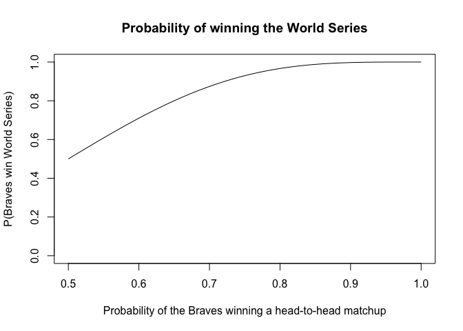
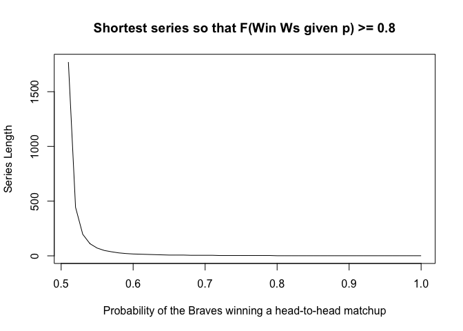

writeup03
================
Wenqi Lyu
9/20/2020

In this assignment, you will write a blog post to answer a series of
questions related to the World Series. You will use the rules of
probability and discrete probability functions to answer the questions.
The audience of your blog post is an HR manager tasked with hiring a
data scientist. The HR manager is looking for candidates that can take a
data science concept and will explain the question and explain the
solution in a way that is accessible to a general audience. **Be sure**
to mention any assumptions of your solution.

Setup:

1.  Suppose that the Braves and the Yankees are teams competing in the
    World Series.
2.  Suppose that in any given game, the probability that the Braves win
    is *P*<sub>*B*</sub> and the probability that the Yankees win is
    *P*<sub>*Y*</sub> = 1 − *P*<sub>*B*</sub>.

Questions to answer:

``` r
library(ggplot2)
```

1.  What is the probability that the Braves win the World Series given
    that *P*<sub>*B*</sub> = 0.55?

<!-- end list -->

``` r
pnbinom(3,4,.55)
```

    ## [1] 0.6082878

2.  What is the probability that the Braves win the World Series given
    that *P*<sub>*B*</sub> = *x*? This will be a figure (see below) with
    *P*<sub>*B*</sub> on the x-axis and *P*(Braves win World Series) on
    the y-axis.

<!-- end list -->

``` r
pb <- seq(0.5,1,by = 0.01)
brave_win <- pnbinom(3,4,pb)

plot(x=pb,
     y=brave_win,
     type="l",
     xlim = c(0.5,1),
     ylim = c(0:1),
     xlab = "Probability of the Braves winning a head-to-head matchup",
     ylab = "P(Braves win World Series)",
     main = "Probability of winning the World Series")
```

<!-- -->

  - When the probability of braves winning a hiead-to-head matchup
    increases, the probability of Braves win world series increase.

<!-- end list -->

3.  Suppose one could change the World Series to be best-of-9 or some
    other best-of-X series. What is the shortest series length so that
    *P*(Braves win World Series|*P*<sub>*B*</sub> = .55) ≥ 0.8

<!-- end list -->

``` r
x <- seq(1,99,2)
prob_win <- pnbinom((x-1)/2,(x+1)/2,0.55)
x[(which(prob_win>0.8))[1]]
```

    ## [1] 71

71 is the shortest series length so that *P*(Braves win World
Series|*P*<sub>*B*</sub> = .55) ≥ 0.8

4.  What is the shortest series length so that *P*(Braves win World
    Series|*P*<sub>*B*</sub> = *x*) ≥ 0.8? This will be a figure (see
    below) with *P*<sub>*B*</sub> on the x-axis and series length is the
    y-axis.

<!-- end list -->

``` r
pb = seq(0.51,1,by=0.01)
short.len = NA
for (i in 1:length(pb)) {
  num.win = seq(1,1000,by=1)
  num.loss = num.win -1
  pws = pnbinom(num.loss,num.win,pb[i])
  len.ser=num.loss+num.win
  short.len[i] = len.ser[which(pws >= 0.8)[1]]
}

plot(
  x=pb,
  y=short.len,
  type="l",
  xlab = "Probability of the Braves winning a head-to-head matchup",
  ylab = "Series Length",
  main = "Shortest series so that F(Win Ws given p) >= 0.8"
)
```

<!-- -->

5.  Calculate *P*(*P*<sub>*B*</sub> = 0.55|Braves win World Series in 7
    games) under the assumption that either *P*<sub>*B*</sub> = 0.55 or
    *P*<sub>*B*</sub> = 0.45. Explain your solution.

*P*(*P*<sub>*B*</sub> = 0.55|Braves win World Series in 7 games) =
*P*(*P*<sub>*B*</sub> = 0.55,Braves win World Series in 7) / *P*(Braves
win World Series in 7 games) = *P*(Braves win World Series in 7 games|
*P*<sub>*B*</sub> = 0.55) \* *P*<sub>*B*</sub> = 0.55 / *P*(Braves win
World Series in 7 games)

1\.*P*(Braves win World Series in 7 games| *P*<sub>*B*</sub> = 0.55)

``` r
dnbinom(3,4,.55)
```

    ## [1] 0.1667701

2\.*P*(Braves win World Series in 7 games)

``` r
(dnbinom(3,4,0.45)+dnbinom(3,4,0.55))/2
```

    ## [1] 0.1516092

3\.*P*<sub>*B*</sub> = 0.55

``` r
0.5
```

    ## [1] 0.5

calculate: *P*(*P*<sub>*B*</sub> = 0.55|Braves win World Series in 7
games)

``` r
dnbinom(3,4,.55)/((dnbinom(3,4,0.45)+dnbinom(3,4,0.55))/2)*0.5
```

    ## [1] 0.55
